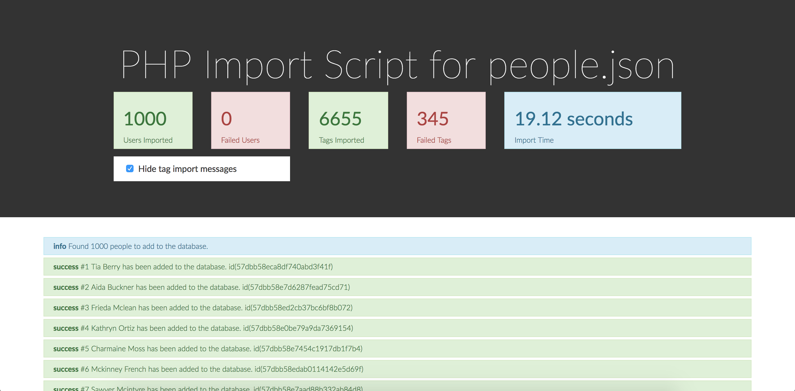

PHP Test
========

You will be creating a database and importing sample data into it from a
JSON file via a PHP script that you will create. Please use PDO when
working with MySQL. You will then be building an API endpoint to list
and then filter this data.

Please do not use any frameworks to complete this test, however, you are
free to create the file structure that you need to best layout this
sample project.

There is no specific right or wrong answer to complete this test but we
will be interested in seeing your approach to creating a working end-
product.

This is not a timed or supervised test, however we expect you to be able
to complete all parts within 2 to 3 hours without assistance from
friends or colleagues.

## Part 1: Import Script and Database

Create a new file for this part.

You will be importing a large JSON file containing `People` into a new
database (database has been created but you will need to create the
table(s)).

You will need to create a database table structure that will work for
the data structure provided in the JSON data file.

You should try to avoid any duplicates when importing the data.
Each `Person` should contain some unique identifier in the JSON data.
You should be able to run the script multiple times without duplicating
data.

## Part 2: API List Endpoint

Create a new file for this part.

You will be building an API endpoint which will list the `People`.
The output should be in JSON (most likely a JSON Array of JSON Objects).

This should support:

- limit
- offset
- orderby

You should also build in some filtering functionality such as for
example:

- people with specific eye colour

Bonus Points:

- fuzzy search of name/email finding people who match search string.

## Part 3: API Statistics Endpoint

Create a new file for this part.

You will be building an api endpoint which will provide statistics for
`People`. This will output reduced data in a JSON Object. (JSON Format)

This should provide the following data:

- total number of male people
- total number of female people
- number of people for each age `20` to `50` (should be a property for
each age e.g. 20, 21, 22, 23, ...)

## Sending us your work

Please zip and send your work back to the recruitment agency that
provided these to you in the first place. They will then forward the
files on to us for review. Alternatively, upload it to your Github or
Bitbucket account and send us the link to it instead.

We will be executing your work upon receiving the files, so we will need
to know from you how to setup and run your files. We therefore need from
you:

- All PHP files and any other the you may wish to include
- A MySQL database dump file
- Any instructions or notes that you may wish to include can be sent
in a notes file or some sort
